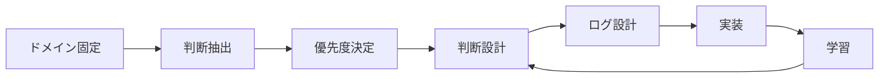
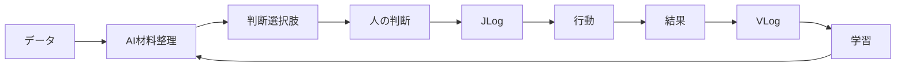

# Judgement-Driven Architecture（判断ドリブンアーキテクチャ）

> This repository contains the **original Japanese version** of the  
> Judgement-Driven Architecture (JDA) theory.  
> An English version will be published separately.

> **判断を残す。組織が賢くなる。**
> **企業はデータではなく「判断」で動いている。**

**One-line definition**
JDAは、**企業の判断をログとして構造化し、人とAIがそこから学習し続ける意思決定インフラを設計する理論**である。

------------------------------------------------------------------------

## なぜこの理論を考えたのか

多くの業務はフローとして記述される。

業務フロー、プロセス図、ワークフローなど、
さまざまな形で整理される。

しかし実際の仕事は、そのフローの通りにきれいには流れない。

**実際の仕事は、都度「判断」によって流れが変わる。**

-   この案件を進めるか
-   この例外を許容するか
-   どちらを優先するか

業務はこうした判断の積み重ねで進んでいる。

しかしその判断は

-   属人化している
-   判断理由が残らない
-   妥当性が検証されない
-   AIが扱えない

という状態が一般的である。

企業にはすでに多くのデータが存在する。

**事実データ**

-   売上
-   受発注情報
-   部品情報

**行動データ**

-   クリック
-   閲覧
-   購買

しかし企業活動にはもう一つ重要なデータがある。

> **判断データ**

である。

例えば営業であれば

-   A社を優先した
-   この案件は見送った
-   この提案を進めた

こうした判断は日々行われている。

しかし

-   なぜその判断をしたのか
-   どの材料を見たのか
-   その判断は妥当だったのか

はほとんど残らない。

Judgement‑Driven Architecture（JDA）は

> **判断を状態として扱い、ログとして蓄積し、学習可能にする構造**

を設計する理論である。

------------------------------------------------------------------------

## JDAとは何か

Judgement‑Driven Architecture（JDA）は

> **判断を学習単位として構造化する設計理論**

である。

JDAは

-   単なる業務プロセス改善手法ではない
-   単なるAI導入フレームワークでもない
-   単なる組織変革理論でもない

JDAは

> **人とAIが「判断」から学習し続ける構造を設計する理論**

である。

------------------------------------------------------------------------

## 用語と略語

| 略語 | 意味 |
|-----|-----|
| JDA | Judgement-Driven Architecture |
| JP | Judgement Point（判断点） |
| JSC | Judgement State Chart（判断状態チャート） |
| JULIA | Judgement Log Impact Assessment（判断ログ優先度評価） |
| JDC | Judgement Design Canvas（判断設計キャンバス） |
| JLog | Judgement Log（判断ログ） |
| VLog | Validity Log（妥当性ログ） |

------------------------------------------------------------------------

## 判断の定義

### 判断とは

**状態を確定させる行為**である。

判断には4つの側面がある。

-   Proceed（進行）
-   Validity（妥当性）
-   Accountability（責任）
-   Venture（冒険）

### 確定とは

責任主体が状態を固定し、
次の遷移を拘束すること。

確定とは

> **未来の選択肢を一つに絞る行為**

である。

### ログとは

その確定の履歴である。

-   誰が
-   何を
-   なぜ確定したか

を残す。

### 学習とは

その確定の妥当性を後から評価し、
次の判断基準に反映すること。

------------------------------------------------------------------------

## Venture判断（冒険判断）

Proceed / Validity / Accountability は
判断を安全に回す構造である。

しかし組織が成長するためには

> **分布外を選択する判断**

も必要になる。

Venture判断とは

> **成功時の価値が非連続であるため、意図的にリスクを取る判断**

である。

前提

-   許容損失の明確化
-   撤退ラインの定義
-   試行回数の設計
-   責任所在の明示
-   判断理由のログ化

### Venture判断の例

**経営レベル**

-   任天堂：ファミコン（NES）
-   ソニー：ウォークマン

**現場レベル**

-   新しい顧客への実験提案
-   定石から外れるクリエイティブ
-   小規模な新規企画の実験

------------------------------------------------------------------------

## JDAの設計原則（Principles）

1.  フローを変えない
2.  判断を学習単位にする
3.  AIは判断材料を提示する
4.  Venture判断を許容する
5.  判断ログは学習循環を作る

------------------------------------------------------------------------

## JDAの全体構造



------------------------------------------------------------------------

## フェーズ概要

JDAは以下のフェーズで設計と実装を進める。

### フェーズ0：判断の土台を整える

-   判断ドメイン境界を定義
-   業務ジャーニー抽出
-   改善しない
-   ToBeを描かない

### フェーズ1：判断抽出

-   業務ジャーニー分解
-   判断点（JP）列挙
-   判断状態チャート（JSC）定義

### フェーズ2：優先度決定（JULIA）

評価軸

-   影響度
-   頻度
-   属人性
-   学習価値

### フェーズ3：判断設計（JDC）

-   人が判断するか
-   AIが支援するか
-   AIが代替するか
-   Venture判断か
-   責任主体
-   エスカレーション

### フェーズ4：ログ設計

-   判断材料
-   判断選択肢
-   判断結果
-   判断理由
-   妥当性評価

### フェーズ5：実装

-   DB / JSON設計
-   UI設計
-   ワークフロー統合
-   AI接続（LLM / RAG / SLM）

### フェーズ6：学習

-   妥当性レビュー
-   判断傾向分析
-   Venture振り返り
-   基準更新

------------------------------------------------------------------------

## 判断ログ循環（JDA Learning Loop）



------------------------------------------------------------------------

## 最小実装イメージ

```python
options = AI.propose_options(context)

decision = human.select(options)

JLog.save(
    context=context,
    decision=decision,
    options=options
)

result = observe_result()

VLog.save(
    decision=decision,
    result=result
)

AI.learn(JLog, VLog)
```

------------------------------------------------------------------------

## JDAのポジショニング

  分野           対象           保存されるもの
  -------------- -------------- ----------------
  BI             事実データ     売上・ログ
  プロセス改善   業務フロー     作業手順
  AI             予測・生成     モデル
  **JDA**        **意思決定**   **判断ログ**

JDAは

> **「判断」を扱う領域**

である。

------------------------------------------------------------------------

## AIとの関係

JDAはAI導入理論ではない。

> **AIが自然に入り込める構造を先に設計する理論**

AI

-   判断材料収集
-   判断材料整理
-   選択肢提示
-   最適化

人

-   最終判断
-   Venture判断
-   責任判断

------------------------------------------------------------------------

## 長期ビジョン

JDAの長期的な目的は

企業の判断ログを蓄積し
組織とAIが共有する

> **企業版世界モデル**

を形成することである。

これにより

-   組織学習加速
-   AI意思決定支援
-   **企業風土・企業文化の保存**

が可能になる。

---

## ライセンス

本プロジェクトは **Creative Commons Attribution 4.0 International License（CC BY 4.0）** のもとで公開されています。

利用者は以下が可能です。

- 共有 — 任意の媒体で複製・再配布  
- 改変 — 再構成・変形・派生作品の作成  

商用利用も可能です。

ただし以下の条件があります。

- **表示（Attribution）** — 原著者のクレジットを表示すること

ライセンス全文：

https://creativecommons.org/licenses/by/4.0/
