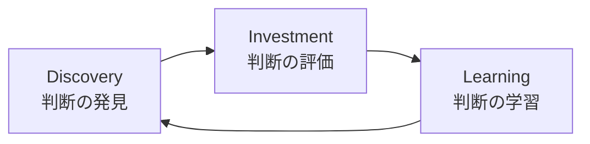

# Judgement-Driven Architecture（判断ドリブンアーキテクチャ）

> This repository contains the original Japanese version of the  
> Judgement-Driven Architecture (JDA) theory.
>
> English version:  
> <https://github.com/judgement-driven/Judgement-Driven-Architecture-EN>
>
> 判断を残す。組織が賢くなる。  
> 企業はデータではなく「判断」で動いている。

---

## One-line definition

JDAは、企業活動に存在する判断を抽出し、評価し、ログ化し、学習することで、企業の意思決定能力を進化させるアーキテクチャである。

---

## なぜこの理論を考えたのか

多くの業務はフローとして記述される。

しかし実際の仕事は、そのフローの通りにきれいには流れない。

実際の仕事は、都度「判断」によって流れが変わる。

- この案件を進めるか  
- この例外を許容するか  
- どちらを優先するか  

業務はこうした判断の積み重ねで進んでいる。

しかしその判断は

- 属人化している  
- 判断理由が残らない  
- 妥当性が検証されない  
- AIが扱えない  

という状態が一般的である。

企業にはすでに多くのデータが存在する。

事実データ

- 売上  
- 受発注情報  
- 部品情報  

行動データ

- クリック  
- 閲覧  
- 購買  

しかし企業活動には、もう一つ重要なデータがある。

> 判断データ

である。

さらにAI時代では、AIモデルはコモディティ化する。

競争力は

- どのAIを使うかではなく  
- 何を学習させるか  

になる。

---

## 判断の定義

判断とは状態を確定させる行為である。

判断には4つの側面がある。

- Proceed（進行）  
- Validity（妥当性）  
- Accountability（責任）  
- Venture（冒険）  

---

## Venture判断

非連続な価値を生むためにリスクを取る判断。

既存事業の延長でも、主流から外れ非連続価値を生めばVenture。

例：

- Amazon：AWS  
- Nintendo：Switch  
- トヨタ：プリウス  

---

## JDAとは何か

判断を学習単位として構造化する設計理論。

---

## JDA v1.1 三層構造


```mermaid
flowchart LR
    D[Discovery\n判断の発見]
    I[Investment\n判断の評価]
    L[Learning\n判断の学習]

    D --> I --> L
    L --> D
```

---

## フェーズ概要

JDAは以下のフェーズで設計と実装を進める。

### フェーズ0：判断の土台を整える

- 業務理解（Hearing）
- 判断ドメイン境界の定義
- JDA-BMCによる対象領域の絞り込み
- 改善しない
- ToBeを描かない

### フェーズ1：判断構造の発見（Discovery）

- Judgement Chainの把握
- Judgement Journeyの抽出
- Judgement Point（JP）の列挙

### フェーズ2：影響評価（JULIA）

- Judgement ROIの概算
- 影響度の評価
- 優先順位の決定

### フェーズ3：判断設計

- JSC（状態遷移の設計）
- JDC（判断設計の定義）

### フェーズ4：ログ設計

- 判断材料
- 判断選択肢
- 判断結果
- 判断理由
- 妥当性評価

### フェーズ5：実装

- DB / JSON設計
- UI設計
- ワークフロー統合
- AI接続

### フェーズ6：学習

- 妥当性レビュー
- 判断傾向分析
- Venture振り返り
- 判断基準の更新

---

## Judgement ROI

Judgement ROI  
= 判断頻度 × 判断影響額 × 判断品質改善率 − 導入コスト

---

## JULIA

Judgement Log Impact Assessment

判断ログの影響を評価し、どの判断を優先的に扱うかを決定する。

---

## JDC

Judgement Design Canvas（判断設計キャンバス）

---

## Learning Loop

Data → AI → Options → Human → JLog → Action → Result → VLog → Learning

---

## AIとの関係

JDAはAI導入理論ではない。

AIが判断を支援し、学習できる構造を設計する理論である。

---

## v1.0 → v1.1 差分

| 項目 | v1.0 | v1.1 |
| ------ | ------ | ------ |
| 構造 | プロセス中心 | 三層構造（Discovery / Investment / Learning） |
| ROI | 未定義 | Judgement ROI導入 |
| JULIA | 優先順位付け | 判断投資フレーム |
| 判断構造 | JJ / JP | Chain / Journey / Point |
| JDAの位置づけ | ログ設計 | 判断投資アーキテクチャ |

---

## 長期ビジョン

企業世界モデルの構築

---

## ライセンス

Copyright (c) 2026 Shun Takeda（B-AS）

本プロジェクトは **Creative Commons Attribution 4.0 International License（CC BY 4.0）** のもとで公開されています。

利用者は以下が可能です。

- 共有 — 任意の媒体で複製・再配布  
- 改変 — 再構成・変形・派生作品の作成  

商用利用も可能です。

ただし以下の条件があります。

- **表示（Attribution）** — 原著者のクレジットを表示すること

ライセンス全文：

<https://creativecommons.org/licenses/by/4.0/>

## 引用

本理論を研究・記事・資料等で利用する場合は、以下の形で引用してください。

Judgement-Driven Architecture（判断ドリブンアーキテクチャ）
著者：武田 俊（B-AS）
GitHub Repository
<https://github.com/judgement-driven/Judgement-Driven-Architecture>

### BibTeX

```bibtex
@misc{JDA2026,
  title={Judgement-Driven Architecture},
  author={Takeda, Shun},
  year={2026},
  howpublished={GitHub Repository},
  organization={B-AS},
  url={https://github.com/judgement-driven/Judgement-Driven-Architecture}
}
```
